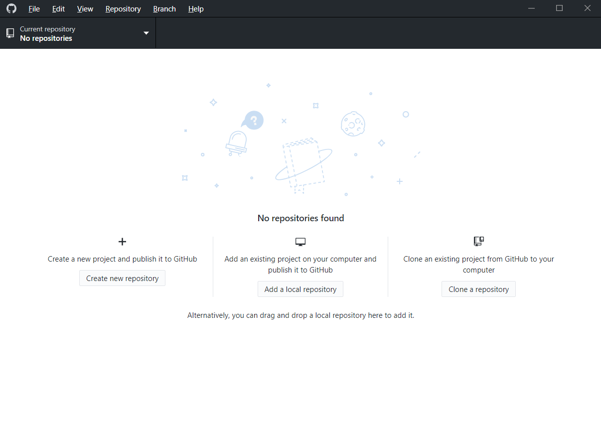
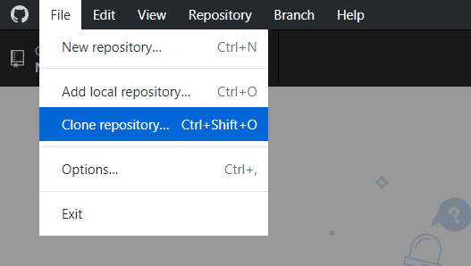
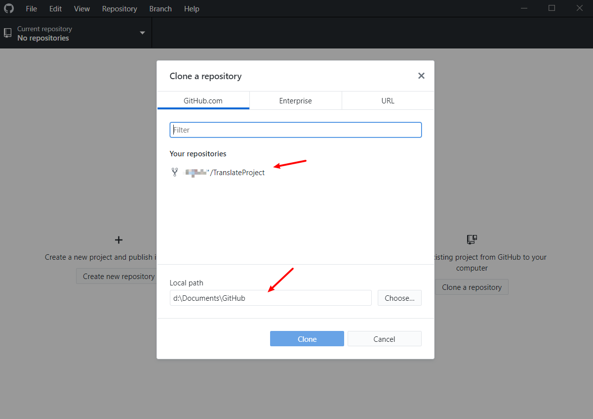
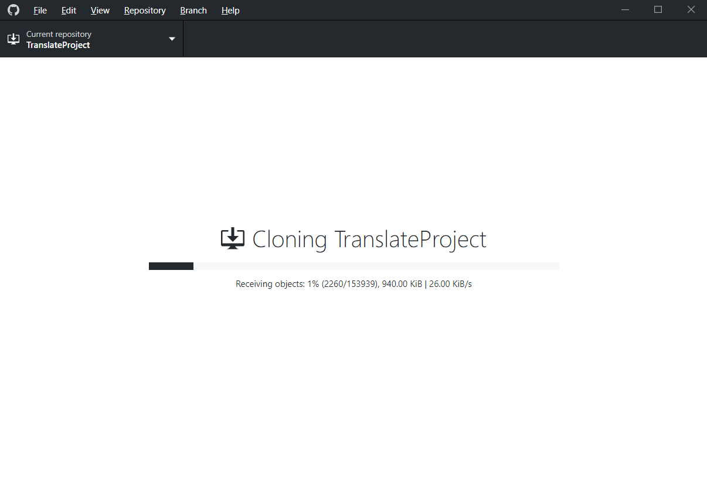
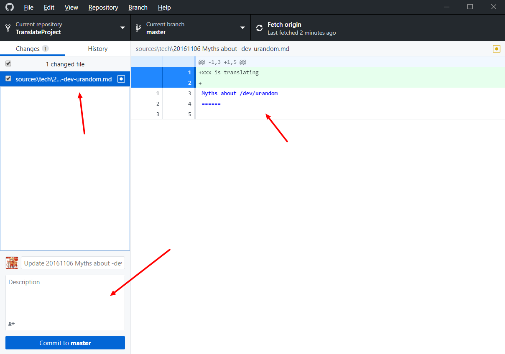
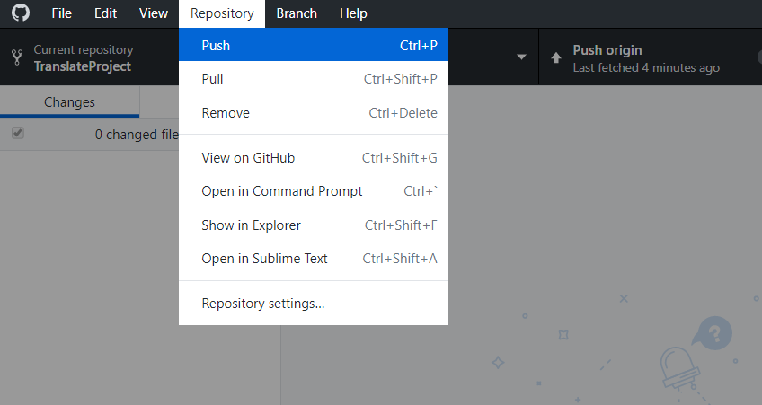
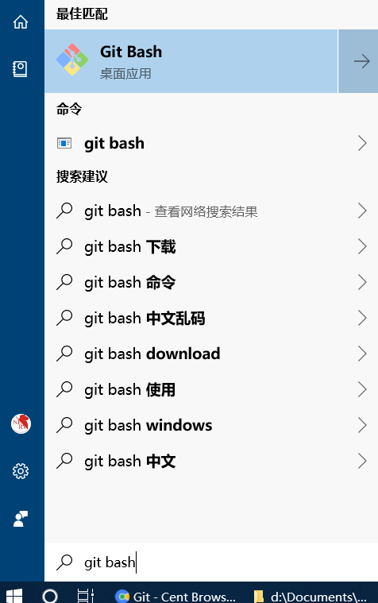

##### 本地

在本地操作有两种方法：使用 GitHub 的客户端，或者使用 git 命令。这两种方法都需要首先在网页 fork LCTT 的代码库，方法参见 web 中的操作。

下来介绍一下两种操作本地操作方法。

##### 1. GitHub 客户端

访问 GitHub 网页下载客户端：https://desktop.github.com/ ，客户端支持 Windows 和 Mac，根据自己的情况选择下载。


安装，运行。



clone 自己的 repo 到本地。



选择保存位置



然后下载，根据个人网速，下载时间不等。



* 申领文章

    下载好代码之后，进入你存放代码库的目录，选择你要翻译的文章，仿照 web 操作在文章开始填入 `xxx is translating` ，然后 commit 到自己的 repo，并 push 到 GitHub。

    

    

    最后在网页上发起 pull request，方法同 web 方式。

* 提交译文

    下载好代码之后，进入你存放代码库的目录，将译文粘贴到原文中，修改文末处的译者 ID，去掉申领文章时填写的 `xxx is translating`，然后将文件移动到 `translated/` 下对应的文件夹，然后 commit 到自己的 repo，并 push 到 GitHub。最后在网页上发起 pull request，方法同 web 方式。


##### 2. git 命令

使用 git 命令一般都是在命令行界面操作。推荐从git [官网](https://git-scm.com/)下载安装 git。


以 git on windows 为例，在开始菜单打开 `git bash`，在 bash 中使用命令行操作。



首先 clone 自己 fork 的代码库到本地：

```
git clone https://github.com/xxx/TranslateProject
```

然后在本地修改文件，commit 修改：

```
git commit -a -m "xxxx"
```

push 修改到 GitHub，此处会提示你输入自己的 GitHub 用户名和密码，同时输入密码时是没有回显的。

```
git push
```

注意，提交译文的时候，需要将 `source/talk` 或 `/source/tech/` 中你申领的原文删掉，在 `translated` 目录下对应的文件夹中放置你的译文，译文和原文的文件名是完全一样的。

最后在网页上发起 pull request，方法同 web 方式。


